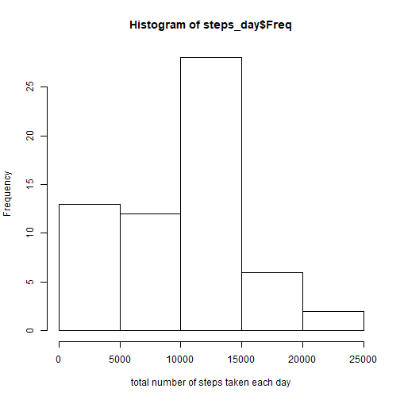
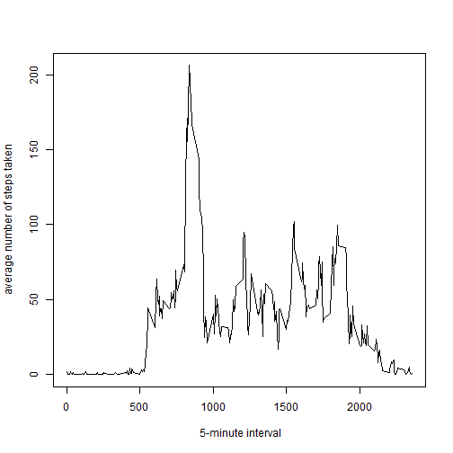
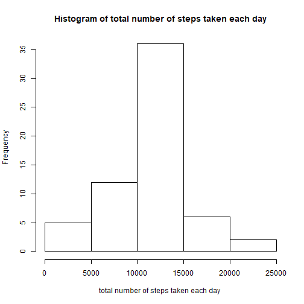
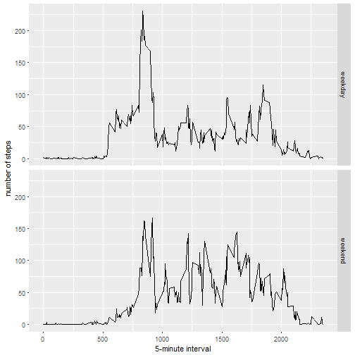

```r
---
title: "PA1_template"
output: html_document
---
*Loading and preprocessing the data*
```

```
## Error: <text>:5:1: unexpected '*'
## 4: ---
## 5: *
##    ^
```


## Loading and preprocessing the data

Show any code that is needed to

1.Load the data 

2.Process/transform the data (if necessary) into a format suitable for your analysis


```r
#Load Data

activ<-read.csv("./activity.csv")

#Remove NA's
NO_NA<- na.omit(activ)
```

## What is mean total number of steps taken per day?

Calculate the total number of steps taken per day


```r
steps_day<-as.data.frame(xtabs(steps~date , data = NO_NA))
```

Make a histogram of the total number of steps taken each day


```r
hist(steps_day$Freq, xlab = "total number of steps taken each day")
```



Calculate and report the mean and median of the total number of steps taken per day


```r
summary(steps_day)[3:4, 2]
```

```
##                                     
## "Median :10395  " "Mean   : 9354  "
```

## What is the average daily activity pattern?

Make a time series plot of the 5-minute interval (x-axis) and the average number of steps taken, averaged across all days (y-axis)


```r
mean_interval<-as.data.frame(tapply(NO_NA$steps, NO_NA$interval, mean))
mean_interval$interval<-rownames(mean_interval)
colnames(mean_interval)<- c("mean", "interval")
plot(mean_interval$interval, mean_interval[[1]] , type = "l", xlab = " 5-minute interval", ylab ="average number of steps taken")
```



Make a panel plot containing a time series plot (i.e. type = "l") of the 5-minute interval (x-axis) and the average number of steps taken, averaged across all weekday days or weekend days (y-axis).
Which 5-minute interval, on average across all the days in the dataset, contains the maximum number of steps?


```r
mean_interval[mean_interval$mean == max(mean_interval$mean), ]
```

```
##         mean interval
## 835 206.1698      835
```


## Impute missing values

Calculate and report the total number of missing values in the dataset


```r
sum(is.na(activ$steps))
```

```
## [1] 2304
```

Devise a strategy for filling in all of the missing values in the dataset. My strategy is to use the mean  for that 5-minute interval. I've created a new data "final_data" set that is equal to the original one and then I've filled the NA's in that data set.


```r
final_data<-activ
for (i in 1:nrow(final_data)) {
  if (is.na(final_data[i, 1]) == TRUE){
    date_data<-subset(activ, activ$interval == activ[i, 3])
    final_data[i, 1]<-mean(date_data$steps, na.rm = TRUE)
  }
}
```

Histogram of the total number of steps taken each day after missing values are imputed


```r
imputed<-as.data.frame(xtabs(steps~date , data = final_data))
hist(imputed$Freq, xlab = "total number of steps taken each day ", main = "Histogram of total number of steps taken each day")
```



 Calculate and report the mean and median total number of steps taken per day.
 

```r
summary(imputed)[3:4, 2]
```

```
##                                     
## "Median :10766  " "Mean   :10766  "
```

after we imputed the missing data, we note that mean and median are equal.

##Are there differences in activity patterns between weekdays and weekends?

Create a new factor variable in the dataset with two levels - "weekday" and "weekend" indicating whether a given date is a weekday or weekend day.


```r
final_data$date<-as.Date(final_data$date, "%Y-%m-%d")
final_data$day<-0
for (i in 1:nrow(final_data)){
  if (weekdays(final_data[i, 2]) %in% c("samedi", "dimanche")) {
    final_data[i, 4] <- "weekend"
  }
  else { final_data[i, 4] <- "weekday"}
}
```

Make a panel plot containing a time series plot (i.e. type = "l") of the 5-minute interval (x-axis) and the average number of steps taken, averaged across all weekday days or weekend days (y-axis)


```r
plot_mean<-aggregate(steps~interval+day, data = final_data, mean)
library(ggplot2)
```

```
## Warning: package 'ggplot2' was built under R version 3.3.3
```

```
## Want to understand how all the pieces fit together? Buy the
## ggplot2 book: http://ggplot2.org/book/
```

```r
g<-ggplot(plot_mean, aes(interval, steps))
g+geom_line()+facet_grid(day~.)+xlab("5-minute interval")+ylab("number of steps")
```


```

